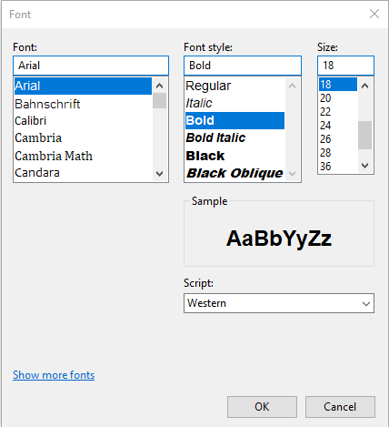
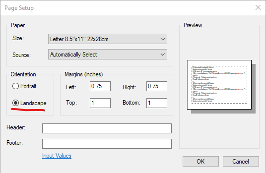

# How to print the generated txt file

## Windows

1. Open the txt file with Notepad.

2. From the "Format" menu, select "Font...".

3. Set the "Font" to "Arial", "Font Style" to "Bold" and "Size" to 18.

    

4. From the "File" menu, select "Page Setup...".

5. Set the "Orientataion" to "Landscape" and click "OK".

    

6. From the "File" menu, select "Print..." (or press Ctrl-P)

7. Select a printer to print.
